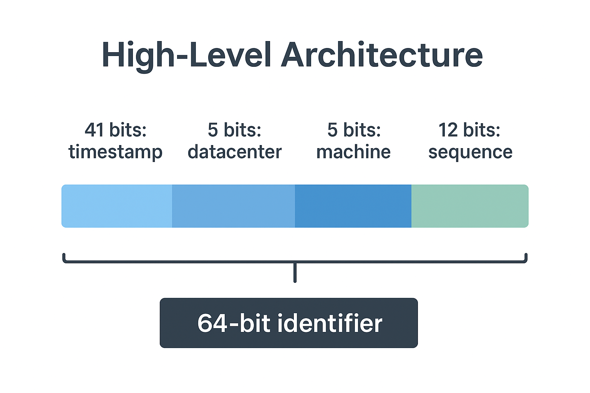

# System Design Sundays – Episode 1: Planet-Scale UUID Generator 🌍

## ⚡️ TL;DR

We're designing a system to generate **forever-unique IDs** at massive scale without any centralized bottleneck. Think of it as creating a unique DNA for every single data object in a system.

---

## 🧩 The Problem Statement

Our goal is to assign unique IDs to millions of objects (users, orders, messages, etc.) across thousands of servers and data centers. The system must meet these critical goals:

* **Absolute Uniqueness:** No two IDs should ever collide, ever.
* **Massive Scalability:** The system must scale horizontally without a performance penalty.
* **Low Latency:** ID generation should take less than a millisecond.
* **Efficiency:** The IDs should be compact, ideally under 128 bits.

---

## 🛠️ The Solution: A Snowflake-Inspired Design

We chose a **Snowflake-like** approach because it provides the best balance of performance, scalability, and efficiency. The core idea is to encode multiple pieces of information directly into a 64-bit integer, making each ID self-contained and unique.

### **High-Level Architecture**

The ID layout is the secret sauce:

`[41 bits: timestamp] | [5 bits: datacenter] | [5 bits: machine] | [12 bits: sequence]`

### **ID Generation Flow**

1.  Read the **current system timestamp** in milliseconds.
2.  Combine it with the unique **datacenter** and **machine** IDs.
3.  Increment a local, in-memory **sequence** number for each ID generated within that millisecond.
4.  Pack these three components into a **64-bit integer** and return it.

---

## 💥 Handling Failure and Trade-offs

| Strategy | Pros | Cons |
| :--- | :--- | :--- |
| **DB `AUTO_INCREMENT`** | Simple, reliable | Not scalable, single point of failure. |
| **Random UUIDv4** | Decentralized, future-proof | Not time-sortable, inefficient for indexing. |
| **Snowflake (Our Choice)** | Compact, time-sortable, decentralized, fast | Requires careful bit-planning and is sensitive to clock drift. |

### **Failure Handling Deep Dive**

* **Clock Drift:** If a server's clock moves backward, it could generate duplicate IDs. Our solution includes a check that **refuses to generate new IDs** until the clock moves forward or is manually synchronized, preventing collisions. This is a critical defensive measure against time-traveling servers.
* **ID Allocation:** Hardcoding `machine` and `datacenter` IDs is risky. To ensure no two machines are ever assigned the same ID, we can dynamically assign these on startup using a coordination service like **Zookeeper** or **etcd**. This makes the system resilient to scaling events and machine failures.

---

## 👨🏻‍💻 Sample Code (Python)

You can find the full, runnable Python code in the `uuid_generator.py` file in this directory.

---

## Further Reading and Enhancements

Here are links that provide more details on the enhancements and further reading for a Snowflake-like UUID generator.

---

### Enhancements

* **Clock Synchronization (NTP)**: [This article by Cloudflare](https://blog.cloudflare.com/how-we-built-our-ntp-service/) provides a great overview of how network time protocol (NTP) works and its importance for distributed systems, including discussions on clock drift.
* **Lexicographical Sorting (ULID/NanoID)**:
    * **ULID:** The official [ULID repository on GitHub](https://github.com/ulid/spec) contains the specification and rationale behind ULID. It clearly explains how it solves the lexicographical sorting problem while maintaining uniqueness.
    * **NanoID:** The [NanoID repository](https://github.com/ai/nanoid) explains its approach, focusing on security and URL-friendliness, which are key benefits of this type of ID.
* **Monitoring**: While not specific to UUIDs, [this article on monitoring distributed systems](https://www.oreilly.com/library/view/distributed-systems-with/9781492042735/ch04.html) by O'Reilly provides an excellent foundation for understanding what metrics to track (like latency, error rates, and resource utilization) in a system like the one you've designed.

---

### Further Reading

* **Twitter's Original Snowflake Paper**: The [blog post announcing Snowflake](https://blog.twitter.com/engineering/en_us/a/2010/announcing-snowflake-a-64-bit-unique-id-generator) is the definitive source and a must-read for anyone interested in this topic. It details the problem Twitter faced and their design choices.
* **UUID.tools**: This is a practical, interactive [web tool](https://uuid.tools/) that allows you to generate and decode different types of UUIDs. It's a great way to visually understand the bit-level composition of various ID formats.

📚 **References**
* [Twitter Snowflake paper](https://blog.twitter.com/engineering/en_us/a/2010/announcing-snowflake-a-64-bit-unique-id-generator)
* [ULID Proposal](https://github.com/ulid/spec)
* [uuid.tools](https://www.uuidtools.com/)